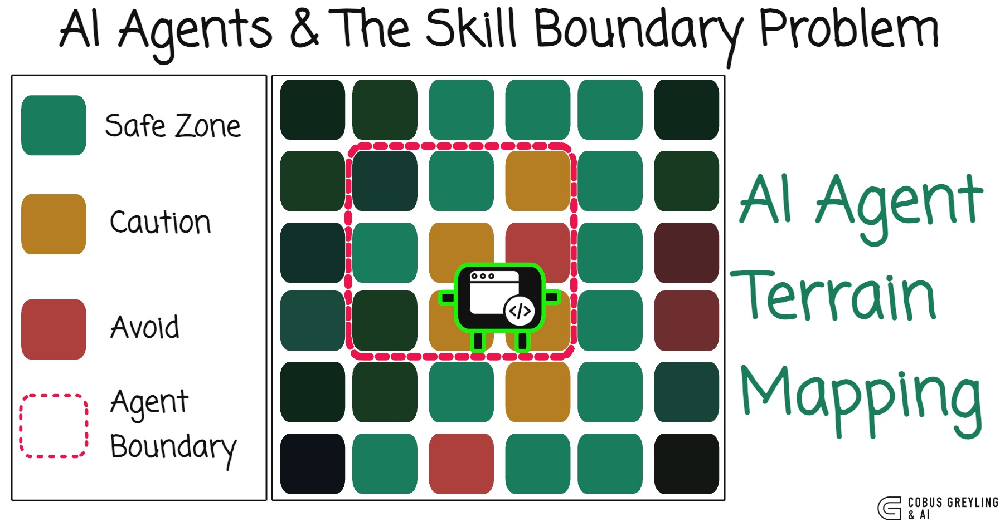
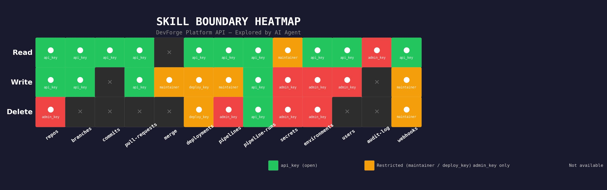

# AI Agents & The Skill Boundary Problem

AI Agents that do not know what they cannot do waste most of their compute trying. Based on the [OSExpert paper](https://arxiv.org/abs/2603.07978v1) by Liu et al. — agents that explore an environment first and map their skill boundaries achieve ~20% performance gains and ~80% efficiency improvements.

## What is in this repo

- **blog.md** — Full blog post on skill boundary awareness, exploration-first execution, and universal agency
- **explore-and-map.py** — AI Agent explores an unknown developer platform API, discovers capabilities, and maps skill boundaries using NVIDIA Nemotron 3 Super
- **skill_boundary_heatmap.py** — Generates the skill boundary heatmap visualisation
- **exploration_report.md** — Full agent exploration output
- **discovered_api_map.json** — Structured API discovery data

## Skill Boundary Heatmap

## Key findings from the paper

- Agents that explore before executing achieve ~20% higher success rates
- The skill boundary check (stopping early on known failures) provided most of the efficiency gain
- General-purpose agents spend 5-50x longer than human experts — most of it wasted on impossible tasks
- Recording failures is as valuable as recording successes

## Related work

- [AI Harness Engineering](https://github.com/cobusgreyling/ai_harness_engineering)
- [AI Agents Less Context](https://github.com/cobusgreyling/ai-agents-less-context)
- [NVIDIA Nemotron 3 Super](https://github.com/cobusgreyling/NVIDIA-Nemotron-3-Super)
- [Token as Hidden Compute Primitive](https://github.com/cobusgreyling/token-hidden-compute-primitive)
