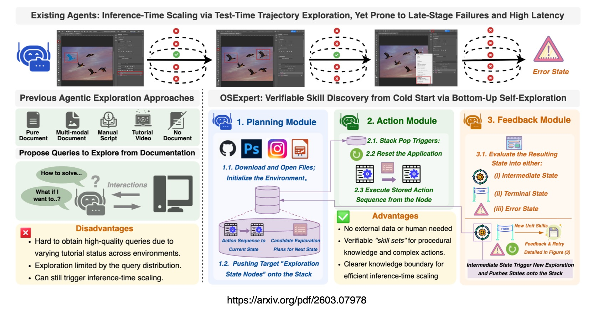
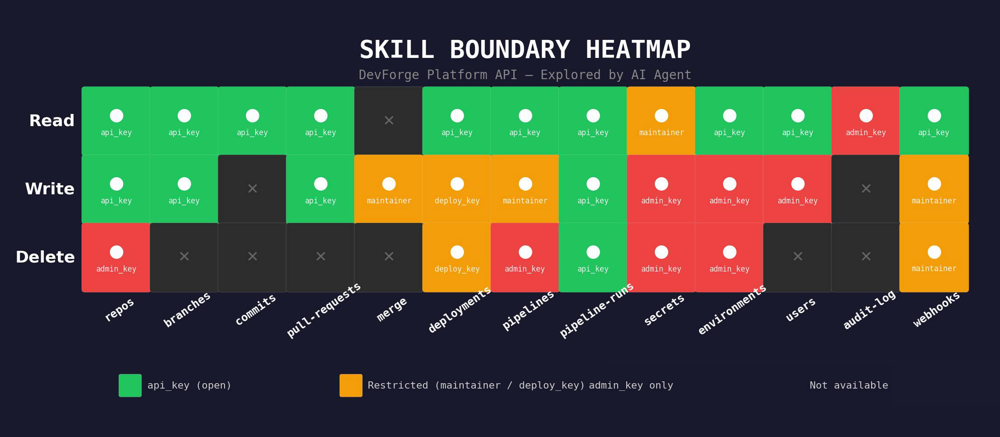

# AI Agents & The Skill Boundary Problem

## AI Agents that do not know what they cannot do waste most of their compute trying

## In Short

Agent exploration before execution is not optional.

An agent that executes without exploring is an agent that does not know what it does not know. The [paper](https://arxiv.org/abs/2603.07978v1) showed a 20% performance gain and 80% efficiency improvement from exploration alone. Let the agent discover the environment before asking it to operate.

Recording failures is as valuable as recording successes.

The skill boundary check, stopping early when a task maps to a known failure, provided most of the efficiency gain. Failed explorations are not wasted. They are the boundary markers that prevent wasted compute at inference time.

Universal agency requires bounded autonomy.

An agent that can connect to any system but does not know its limits is not a universal agent. It is an expensive trial-and-error machine. Exploration gives the agent reach. Boundary awareness gives it discipline. Both are required.

The industry is focused on making AI Agents more capable. The data suggests we should also be making them more self-aware.

## Back to the study

A recent [paper by Liu et al.](https://arxiv.org/abs/2603.07978v1) introduced a concept which I love, skill boundary awareness. The basic premise…

The agent lands in an unknown environment, explores what's there, maps what it can build against, and reports its capabilities and boundaries.

Current AI Agents do not know what they can and cannot do. When they encounter a task beyond their capability, they keep trying. They burn tokens, burn time and burn API calls until the interaction budget runs out. Then they fail. The paper measured this directly. General-purpose computer-use agents spend 5x to 50x longer than human experts on tasks and most of that time is wasted on attempts that were never going to succeed.

The study suggests, before asking the agent to do anything, let it explore the environment first. Build a skill set. Record what works. Record what fails. Then at inference time, if a task maps to a known failure, stop immediately. Do not attempt it.

The result was a +/- 20% performance gain and a +/-80% reduction in the efficiency gap to human experts.

## Explore first, execute second

The study uses a GUI-based depth-first search algorithm. The agent systematically clicks through every menu, every button, every interaction path in a software application. It records what each action does. It verifies the outcome. Successful action sequences become unit skills. Failed sequences become boundary markers.

The agent then composes unit skills into composite workflows, chaining individual operations into multi-step procedures. The result is a complete skill set for that environment, built entirely through autonomous exploration.

Three coordinated modules drive the exploration. A planning module that decides what to try next. An action module that executes the interaction. A feedback module that evaluates the result and classifies it as intermediate (keep going), terminal (skill acquired), or error (try again or mark as boundary).

No human demonstrations. No training data. No tutorials. The agent learns the environment the same way a human expert would — by using it.

Current general-purpose computer-use agents rely on inference-time scaling but remain prone to failures and high latency. Prior approaches attempt to address this by exploring digital environments using human-curated queries or tutorial-derived queries, but both are often unavailable or difficult to obtain for arbitrary environments. [OSExpert](https://oppugno-rushi.github.io/OSExpert) takes a different path. The framework requires no external data and no human effort for exploration queries. It comprehensively discovers the unit functions of a digital environment through autonomous bottom-up exploration, improving both performance and efficiency. Fine-grained actions are handled during the exploration phase itself, and successful sequences are organised into a reusable skill set for inference.

## The boundary check

The most impactful innovation is not exploration itself. It is what happens with the failures.

When an agent explores and repeatedly fails at a specific operation, for example dragging with pixel-level precision, or navigating a deeply nested menu structure, OSExpert records that failure as an explicit skill boundary. At inference time, if a user request maps to a known failure, the agent stops immediately and reports that the task is beyond its current capability.

Current agents do the opposite. They attempt every task with equal confidence. When they fail, they try again with a different approach. When that fails, they try again. This continues until the interaction budget is exhausted. The agent spends 98% of its compute on tasks it was never going to complete.

The paper's ablation study confirmed this. Most of the efficiency gain came from the skill boundary check, not from the fast planner. Agents that knew their limits were dramatically faster, not because they executed tasks more quickly, but because they stopped wasting time on impossible ones.

This maps directly to something I explored in [AI Harness Engineering](https://github.com/cobusgreyling/ai_harness_engineering). Before the agent acts, the Verifier checks whether the action is within the agent's known capability. If not, it stops the loop before tokens are consumed.

## Universal agents must know their edges

For AI Agents to achieve universal agency, true digital autonomy, they must be able to explore and integrate with any system in their ecosystem without pre-configuration.

I also wrote about this in [AI Agents Are Better at Building From Scratch With Less Context](https://github.com/cobusgreyling/ai-agents-less-context). An agent that can build correct services from requirements alone is an agent that can integrate with any system. The less context it needs upfront, the more systems it can reach.

But universal agency without skill boundary awareness is dangerous. An agent that can connect to any system but does not know what it cannot do might attempt everything.

OSExpert's approach solves this. The agent explores first. It discovers what is available. It maps what works. It records what fails. Then it operates within its known boundary.

Exploration gives the agent reach. Boundary awareness gives it discipline.

## The prototype

I built a demo using [NVIDIA Nemotron 3 Super](https://github.com/cobusgreyling/NVIDIA-Nemotron-3-Super) (120B parameters, 12B active per forward pass) that applies the OSExpert concept to API exploration. The agent lands in an unknown API environment with no documentation, no schema, no prior knowledge. It explores systematically…discovering resources, probing endpoints, mapping authentication requirements — and produces a complete capability report with explicit skill boundaries.

The API exploration runs in four phases…

**Phase 1 — Initial Discovery.** The agent probes the API root and discovers resources.

**Phase 2 — Deep Exploration.** For each resource, the agent discovers every endpoint, every HTTP method, every parameter, and every authentication requirement.

**Phase 3 — Agent Analysis.** The full discovery map is sent to the model. The agent reasons about what it can build, what composite workflows are possible, and what is explicitly beyond its capability.

**Phase 4 — Skill Boundary Map.** The agent produces a structured boundary table showing exactly what it can and cannot do at each auth level.

The agent identified 5 buildable applications (CI/CD dashboard, environment provisioner, secret rotation bot, PR merge automation, audit exporter), 3 composite workflows and 9 specific things it cannot do…including reading secret values, executing arbitrary code, managing auth credentials, accessing billing data, and performing bulk operations.

Without exploration, the agent would have attempted all of this blindly. With exploration, it knows exactly where it can operate and where it hits walls.

The code and results are in the repository.

---

*Chief Evangelist @ Kore.ai | I'm passionate about exploring the intersection of AI and language. From Language Models, AI Agents to Agentic Applications, Development Frameworks & Data-Centric Productivity Tools, I share insights and ideas on how these technologies are shaping the future.*
